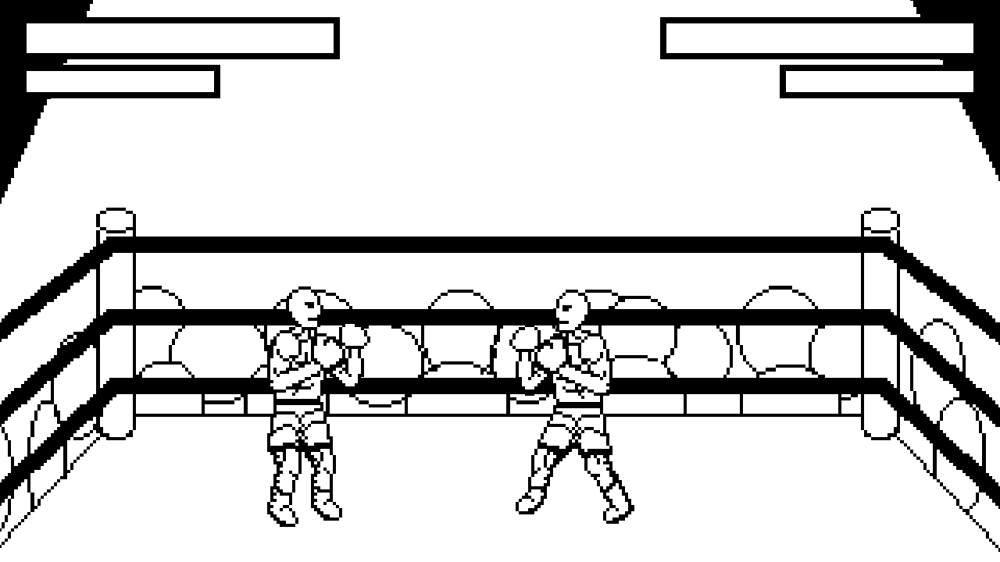

# GPPCC16 - Boxen

Windows download: [link][windownload]<br/>
Linux download: [compile it](#building)

## Controls
* Walk left/right: `A/D`
* Block: `Space`
* Punch: `E`
* Quit: `Escape`

## Screenshot


## Building
### Prerequisites
* SFML 2.5
* Boost
* Cmake
* Git
* C++ environment with C++11 support


### Building
#### Windows
Don't.<br/>
Use the [binary][windownload], except you are a masochist.

#### Linux
1. Clone the repository

    Open a terminal in a directory where you want to download the repository and type:

    ```shell
    $ git clone https://github.com/mphe/gppcc16.git
    $ cd gppcc16
    $ git submodule update --init --recursive
    ```

2. Setup project

    In the repository folder do:
    ```shell
    $ mkdir build
    $ cd build
    $ cmake -DCMAKE_BUILD_TYPE=Release ..
    ```

3. Compile
    ```shell
    $ make
    ```
4. The output files are stored in the build directory under `bin/`.
5. Symlink, move or copy `gppcc16`, `assets/`, and `imgui.ini` into the same directory
6. Enjoy


[windownload]: https://github.com/mphe/gppcc16/releases/latest
